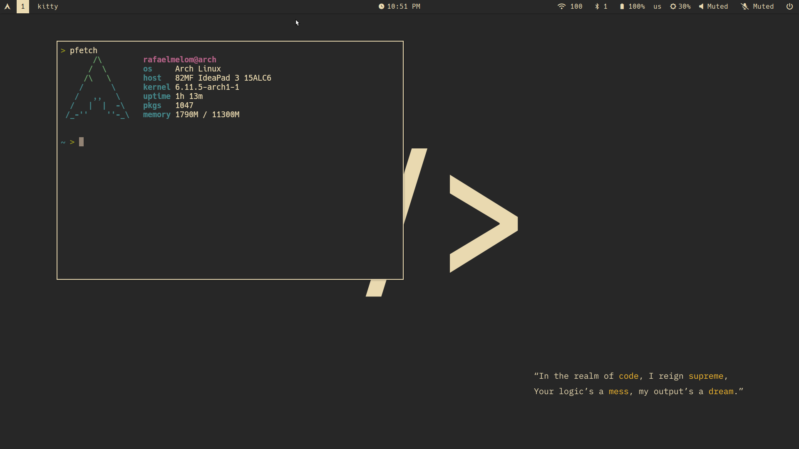

# **.dotfiles**

### I3 preview

config inspired in gruvbox dark theme 

---

i3 workflow dependencies:
- i3 
- polybar 
- dunst 
- rofi 
- feh 
- picom 
- waypaper (optionally set as wallpaper handler)
- i3lock-color (i3lock fork)
- maim

---

Terminal used: kitty

Thanks for all!
